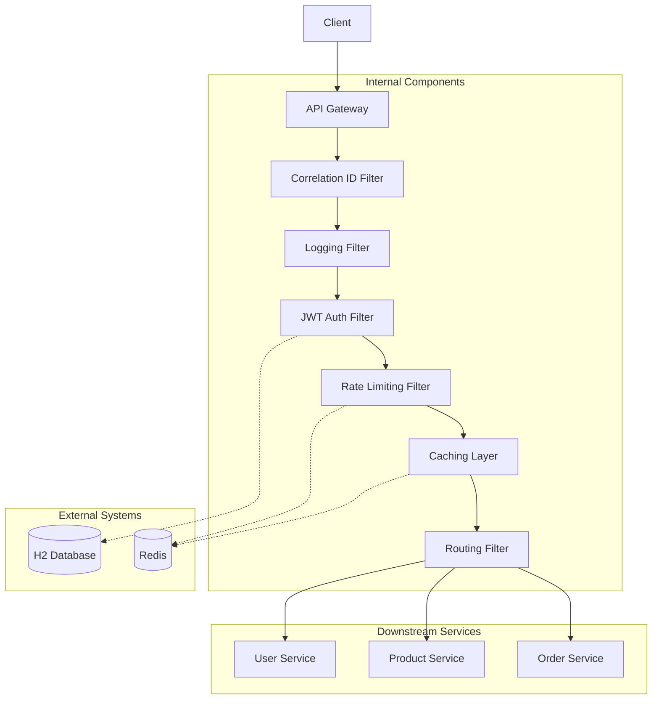

# Custom API Gateway

A high-performance, centralized entry point for microservices built with Spring Boot 4. This gateway provides robust security, traffic management, and observability features.

##  Features

- **JWT Authentication**: Secure endpoints with JSON Web Tokens and Spring Security.
- **Dynamic Routing**: Pattern-based request forwarding to downstream services.
- **Rate Limiting**: Redis-backed IP-based rate limiting (Fixed Window).
- **Response Caching**: Distributed caching with Redis to reduce backend load.
- **Custom Middleware**:
  - **Correlation ID**: Trace requests across multiple services.
  - **Request Logging**: Monitor method, path, IP, status, and duration.
  - **Header Manipulation**: Inject custom headers for downstream context.
- **API Documentation**: Integrated Swagger/OpenAPI UI.
- **CI/CD Ready**: Automated testing and deployment with GitHub Actions and Railway.
- **Docker Ready**: Easy local development with Docker Compose.

##  Architecture



##  Technology Stack

- **Core**: Spring Boot 4.0.3, Spring Framework 7
- **Security**: Spring Security, JJWT
- **Data**: Spring Data JPA, H2 (Auth DB), Spring Data Redis
- **Routing**: Spring Cloud Gateway Server (WebMVC)
- **Documentation**: SpringDoc OpenAPI
- **Build**: Maven 3.9.11
- **Testing**: JUnit 5, Mockito, MockMvc

##  Getting Started

### Prerequisites
- Java 21 (LTS)
- Maven 3.9+
- Redis (For rate limiting and caching)

### Local Development
1. Clone the repository:
   ```bash
   git clone https://github.com/brain188/-Custom_API_Gateway.git
   cd -Custom_API_Gateway/gateway
   ```
2. Run tests:
   ```bash
   ./mvnw test
   ```
3. Run the application:
   ```bash
   ./mvnw spring-boot:run
   ```

### Using Docker (Local)
```bash
docker-compose up --build
```

##  CI/CD & Deployment

### GitHub Actions
The project includes a CI pipeline in `.github/workflows/ci.yml` that automatically:
- Sets up a Redis service.
- Builds the project with Maven.
- Runs all unit and integration tests.
- Validates the Docker build.

### Deployment (Railway)
The gateway is configured for automatic deployment on **Railway**. 
- **Auto-Deploy**: Every push to the `main` branch triggers a new deployment on Railway.
- **Dynamic Port**: The application uses the `PORT` environment variable provided by Railway.
- **Health Checks**: Railway monitors the deployment to ensure the gateway is healthy.

##  API Documentation

Once the application is running, access the Swagger UI at:
[http://localhost:8080/swagger-ui.html](http://localhost:8080/swagger-ui.html)

### Key Endpoints
- `POST /auth/signup`: Register a new user.
- `POST /auth/login`: Authenticate and receive a JWT.
- `GET /api/**`: Proxy requests to downstream services (configurable in `application.properties`).

##  Configuration

Routes and rate limits are defined in `src/main/resources/application.properties`:

```properties
# Example Route
gateway.routes.[/api/users/**]=http://localhost:8081
gateway.rateLimits.[/api/users/**]=5
gateway.cacheable.[/api/products/**]=true
```

##  Testing

The project includes an extensive test suite with 14 tests covering:
- **Unit Tests**: JWT utilities, rate limiting logic, and proxy services.
- **Integration Tests**: End-to-end flows for authentication and gateway routing.

Run all tests:
```bash
./mvnw test
```
